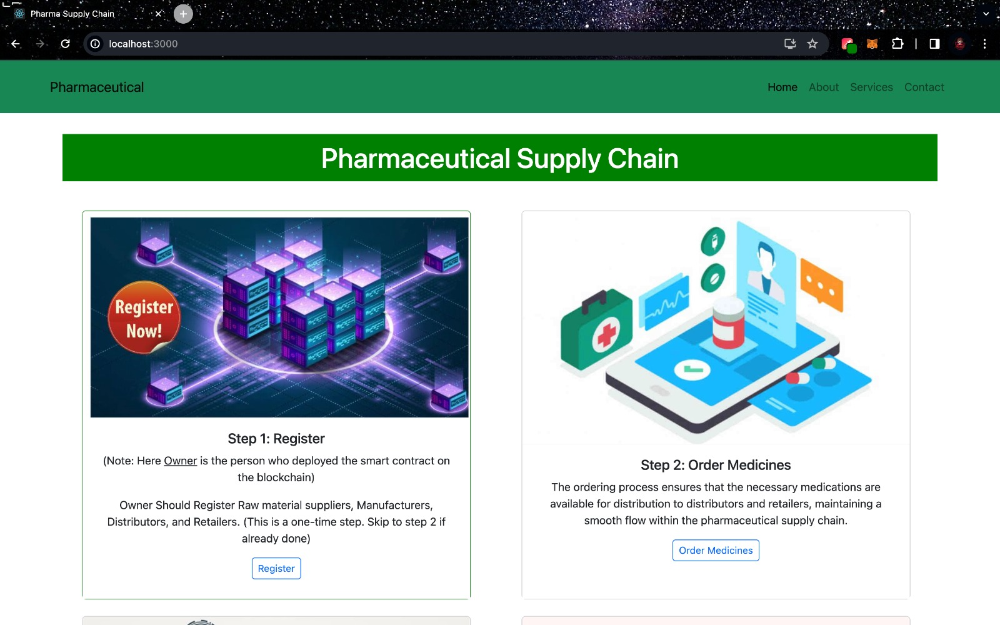
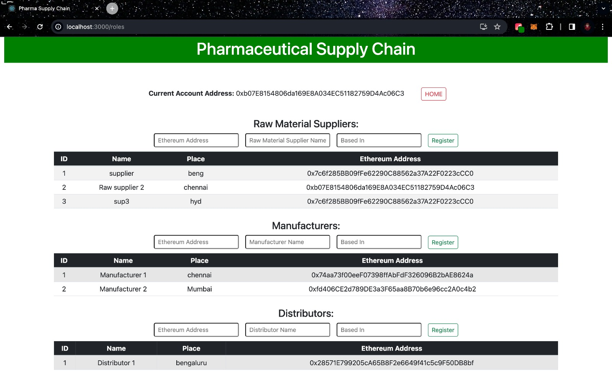
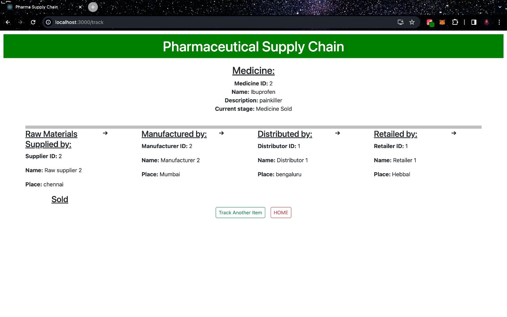
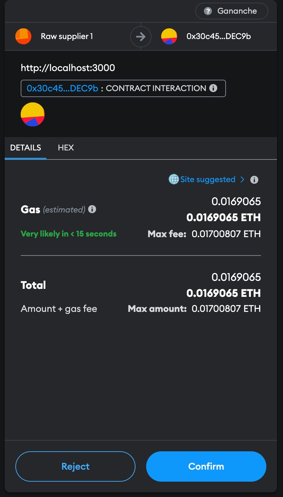
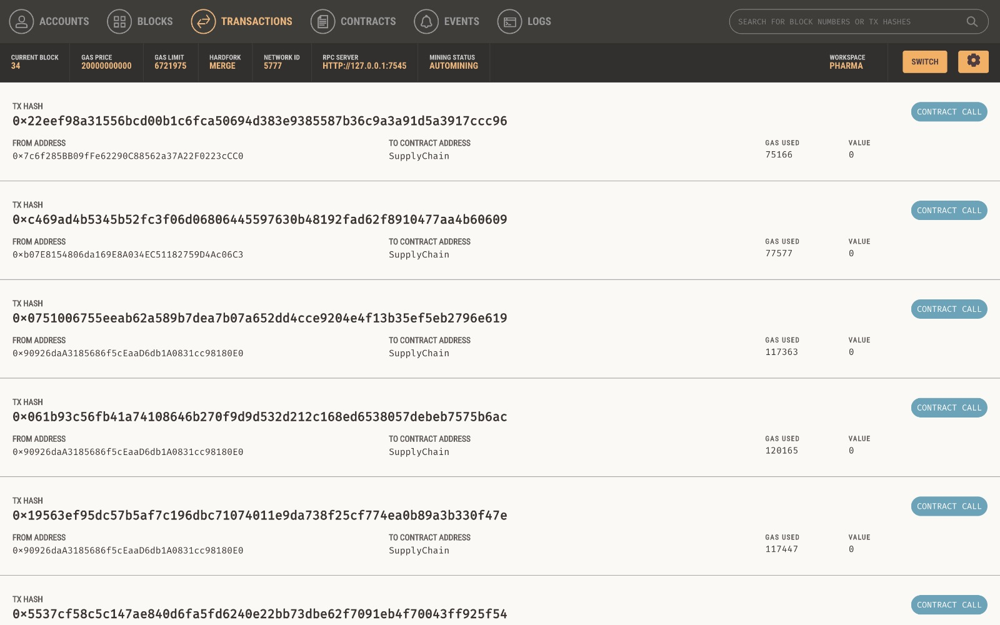

# Blockchain Based Drug Supply management 

## Demo







## 🔧 Setting up Local Development

### Step 1

Open ganache UI/cli and configure truffle-config.js file. Not required for most cases.

### Step 2

Import the ganache local blockchain accounts in metamask using the mnemonic provided.

### Step 3

# For Cloning the repo, follow these steps:

Linux and macOS:

```bash
sudo git clone https://github.com/ymsanthosh/Blockchain-based-Drug-supply-Management-.git
```

Windows:

```bash
git clone https://github.com/ymsanthosh/Blockchain-based-Drug-supply-Management-.git

### Step 4

Compile and deploy the smart contract

```bash
npx truffle compile
npx truffle migrate
```

> NOTE: If you make changes in the smart contract you have to redeploy it using `npx truffle migrate --reset`

### Step 5

Install `node_modules` using `yarn`

```bash
cd client
yarn
```

Install `node_modules` using `npm`

```bash
cd client
npm install
```

### Step 6

Start the development server using `yarn`

```bash
yarn start
```

Start the development server using `npm`

```bash
npm start
```

The site is now running at `http://localhost:3000`!
Open the source code and start editing!

# Thank You
